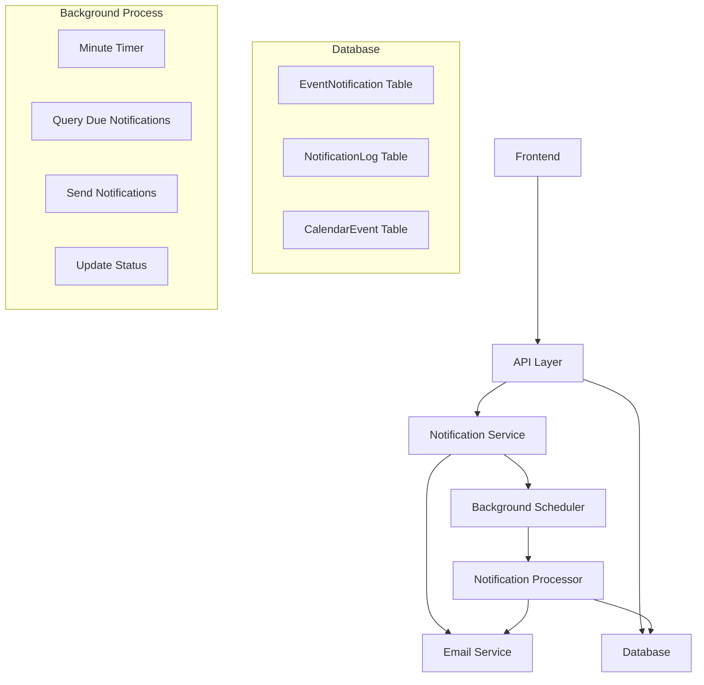

# Design Document

## Overview

The enhanced notification system will replace the current notification implementation with a more precise, time-based approach. Instead of checking for events within time windows, the system will calculate exact notification times when reminders are created and use a minute-based scheduler to send notifications precisely when due.

### Key Design Principles

1. **Precision**: Calculate exact notification times (e.g., 12:55 for a 13:00 event with 5-minute reminder)
2. **Reliability**: Use a simple minute-based scheduler that runs every 60 seconds
3. **Consistency**: Ensure notification times are updated when events or reminders change
4. **Scalability**: Design for efficient querying and processing of due notifications
5. **Maintainability**: Clean separation between notification scheduling and delivery

## Architecture

### High-Level Architecture



### System Flow

1. **Notification Creation**: When a user adds a reminder, calculate exact notification time
2. **Background Processing**: Every minute, query for notifications due in current minute
3. **Notification Delivery**: Send emails for due notifications and mark as sent
4. **Status Tracking**: Log all notification attempts for monitoring and debugging

## Components and Interfaces

### 1. Enhanced Notification Service

**Purpose**: Core service managing notification lifecycle and background processing

**Key Methods**:

```typescript
interface EnhancedNotificationService {
  // Lifecycle management
  start(): void;
  stop(): void;

  // Notification CRUD operations
  createNotificationsForEvent(
    eventId: string,
    eventStart: Date,
    notifications: NotificationConfig[]
  ): Promise<void>;
  updateNotificationsForEvent(
    eventId: string,
    eventStart: Date,
    notifications: NotificationConfig[]
  ): Promise<void>;
  deleteNotificationsForEvent(eventId: string): Promise<void>;

  // Background processing
  processScheduledNotifications(): Promise<void>;

  // Monitoring and debugging
  getNotificationStatus(): Promise<NotificationStatus>;
  cleanupOldNotifications(): Promise<void>;
}

interface NotificationConfig {
  notificationType: "email" | "browser";
  minutesBefore: number;
  isEnabled: boolean;
}
```

### 2. Notification Calculator

**Purpose**: Utility for calculating exact notification times

**Key Methods**:

```typescript
interface NotificationCalculator {
  calculateNotificationTime(eventStart: Date, minutesBefore: number): Date;
  validateNotificationTime(notificationTime: Date): boolean;
  roundToMinute(date: Date): Date;
}
```

### 3. Email Notification Handler

**Purpose**: Handles email composition and delivery

**Key Methods**:

```typescript
interface EmailNotificationHandler {
  sendEventReminder(
    event: CalendarEvent,
    user: User,
    minutesBefore: number
  ): Promise<void>;
  generateEmailContent(
    event: CalendarEvent,
    user: User,
    timeUntilEvent: string
  ): Promise<string>;
}
```

### 4. Notification API Controller

**Purpose**: REST API endpoints for managing notifications

**Endpoints**:

- `GET /notifications/event/:eventId` - Get notifications for an event
- `PUT /notifications/event/:eventId` - Update notifications for an event
- `DELETE /notifications/event/:eventId` - Delete all notifications for an event
- `GET /notifications/status` - Get system status and pending notifications
- `POST /notifications/test/:eventId` - Send test notification

## Data Models

### Enhanced EventNotification Model

The existing `EventNotification` model will be enhanced with better indexing and validation:

```sql
-- Enhanced indexes for efficient querying
CREATE INDEX CONCURRENTLY idx_event_notification_time_enabled
ON event_notification (notification_time, is_enabled, is_sent)
WHERE is_enabled = true AND is_sent = false;

CREATE INDEX CONCURRENTLY idx_event_notification_event_type
ON event_notification (event_id, notification_type);

-- Add constraint to ensure notification_time is in future when created
ALTER TABLE event_notification
ADD CONSTRAINT chk_notification_time_future
CHECK (notification_time > created_at);
```

### Notification Processing State

```typescript
interface NotificationProcessingState {
  currentMinute: Date;
  pendingNotifications: EventNotification[];
  processedCount: number;
  failedCount: number;
  errors: NotificationError[];
}

interface NotificationError {
  notificationId: string;
  eventId: string;
  userId: string;
  error: string;
  timestamp: Date;
}
```

## Error Handling

### Error Categories

1. **Validation Errors**: Invalid notification configurations
2. **Calculation Errors**: Issues with time calculations
3. **Delivery Errors**: Email service failures
4. **Database Errors**: Connection or query failures
5. **System Errors**: Background process failures

### Error Handling Strategy

```typescript
interface NotificationErrorHandler {
  handleValidationError(error: ValidationError): void;
  handleDeliveryError(
    notification: EventNotification,
    error: Error
  ): Promise<void>;
  handleSystemError(error: Error): void;

  // Retry logic for transient failures
  shouldRetryNotification(
    notification: EventNotification,
    error: Error
  ): boolean;
  scheduleRetry(
    notification: EventNotification,
    retryDelay: number
  ): Promise<void>;
}
```

### Retry Logic

- **Email delivery failures**: Retry up to 3 times with exponential backoff
- **Database connection issues**: Retry with circuit breaker pattern
- **Validation errors**: No retry, log and mark as failed
- **System errors**: Log and continue processing other notifications

## Testing Strategy

### Unit Tests

1. **Notification Calculator Tests**
   - Test time calculations for various scenarios
   - Test edge cases (past dates, timezone handling)
   - Test validation logic

2. **Service Layer Tests**
   - Test CRUD operations for notifications
   - Test background processing logic
   - Test error handling scenarios

3. **Email Handler Tests**
   - Test email content generation
   - Test delivery success/failure scenarios
   - Test user preference handling

### Integration Tests

1. **End-to-End Notification Flow**
   - Create event with reminders
   - Verify notifications are scheduled correctly
   - Simulate time passage and verify delivery
   - Test notification updates and deletions

2. **API Endpoint Tests**
   - Test all notification API endpoints
   - Test authentication and authorization
   - Test input validation and error responses

3. **Background Process Tests**
   - Test scheduler startup and shutdown
   - Test processing of multiple notifications
   - Test handling of system failures

### Performance Tests

1. **Load Testing**
   - Test processing of large numbers of notifications
   - Test database query performance
   - Test email delivery throughput

2. **Stress Testing**
   - Test system behavior under high load
   - Test memory usage and garbage collection
   - Test database connection pooling

## Implementation Phases

### Phase 1: Core Infrastructure

- Implement enhanced notification service
- Create notification calculator utility
- Set up database indexes and constraints
- Implement basic background scheduler

### Phase 2: Email Integration

- Implement email notification handler
- Integrate with Resend email service
- Create email templates and styling
- Add user preference handling

### Phase 3: API Layer

- Implement notification API endpoints
- Add input validation and error handling
- Integrate with existing event management
- Add comprehensive logging

### Phase 4: Monitoring and Maintenance

- Implement status monitoring endpoints
- Add cleanup processes for old data
- Create debugging and troubleshooting tools
- Add performance monitoring

### Phase 5: Testing and Deployment

- Comprehensive test suite implementation
- Performance testing and optimization
- Documentation and deployment guides
- Migration from existing system

## Security Considerations

### Authentication and Authorization

- All notification endpoints require user authentication
- Users can only manage notifications for their own events
- API rate limiting to prevent abuse

### Data Privacy

- Email content includes only necessary event information
- Notification logs are automatically cleaned up
- User preferences are respected for all communications

### Input Validation

- Strict validation of notification times and configurations
- Sanitization of email content to prevent injection attacks
- Validation of event ownership before notification operations

## Performance Considerations

### Database Optimization

- Efficient indexes for time-based queries
- Partitioning of notification logs by date
- Connection pooling and query optimization

### Background Processing

- Efficient querying using time-based indexes
- Batch processing of multiple notifications
- Graceful handling of processing delays

### Email Delivery

- Asynchronous email sending to prevent blocking
- Rate limiting to respect email service limits
- Efficient template rendering and caching

## Monitoring and Observability

### Metrics to Track

- Number of notifications processed per minute
- Email delivery success/failure rates
- Background process health and uptime
- Database query performance
- User engagement with notifications

### Logging Strategy

- Structured logging for all notification operations
- Error logging with context and stack traces
- Performance logging for slow operations
- Audit logging for notification management actions

### Health Checks

- Background process health monitoring
- Database connectivity checks
- Email service availability checks
- Overall system status reporting
