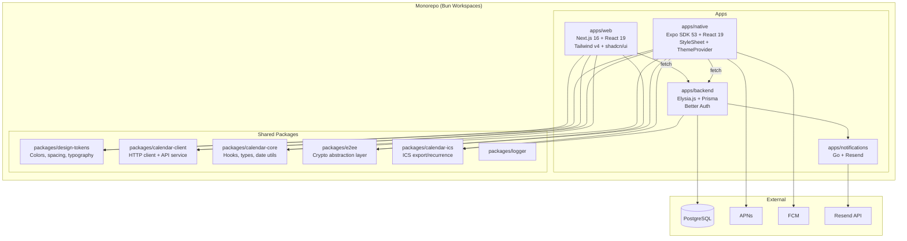
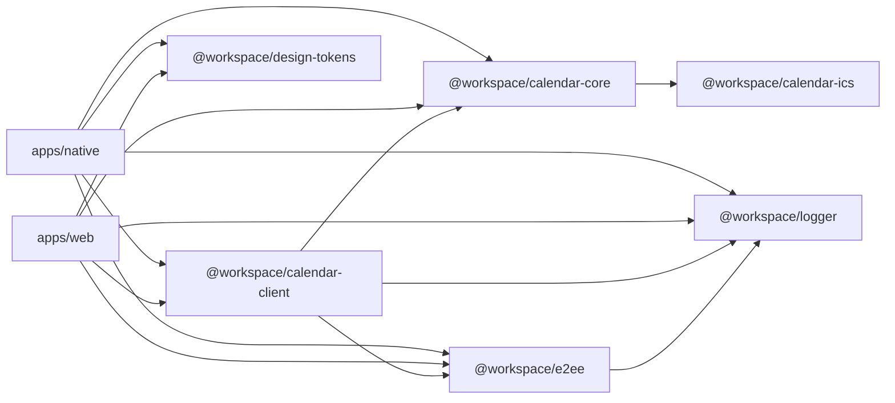
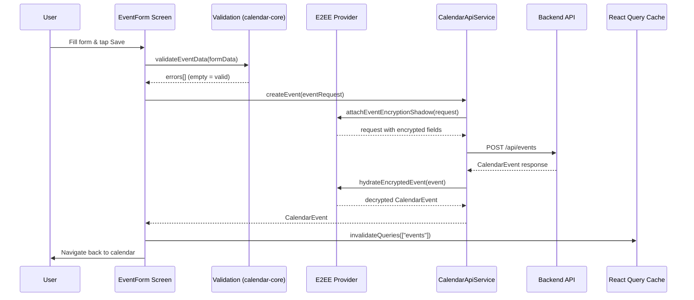
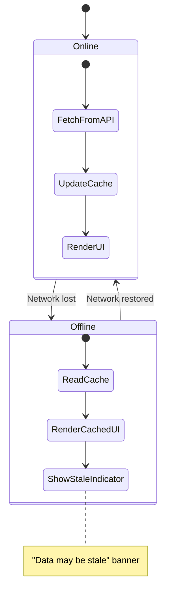
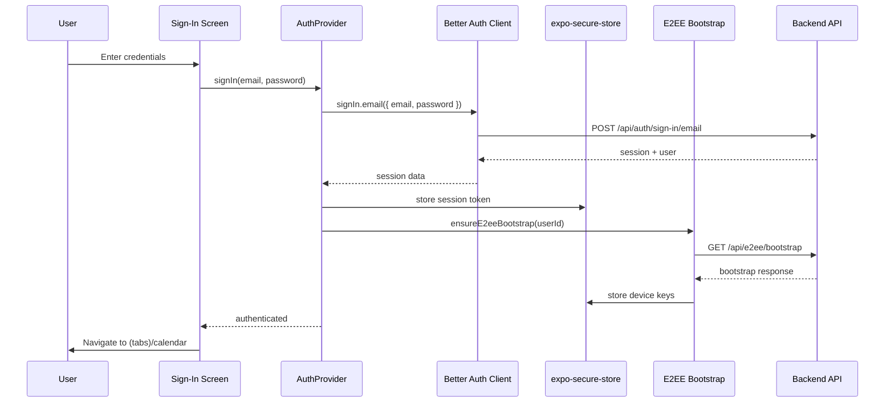

# Design Document: Expo Native Rewrite

## Overview

This design describes the architecture for `apps/native`, a new Expo React Native application that replaces the existing Capacitor/Ionic WebView-based mobile experience. The native app communicates with the same Elysia.js backend API and replicates all calendar features with true native rendering performance.

The core strategy is **extract-and-share**: platform-agnostic business logic currently embedded in `apps/web/lib/` is extracted into workspace packages (`packages/calendar-client`, `packages/calendar-core`, `packages/design-tokens`, `packages/e2ee`), then consumed by both the web and native apps. The native app builds its own UI layer using `StyleSheet.create()` with a custom `ThemeProvider` for design token access.

### Key Design Decisions

| Decision | Choice | Rationale |
|---|---|---|
| Styling | `StyleSheet.create()` + ThemeProvider | Zero third-party styling deps; predictable native perf |
| Navigation | Expo Router (file-based) | Convention-over-config; deep linking built-in |
| State management | React Query + React Context | Matches web app pattern; built-in caching/offline |
| Auth | Better Auth client + `expo-secure-store` | Same auth flow as web; platform-secure token storage |
| Crypto | `expo-crypto` + `react-native-quick-crypto` | Web Crypto API equivalent for E2EE on native |
| Gestures | `react-native-gesture-handler` + `react-native-reanimated` | 60fps native gesture thread; already in monorepo |
| Push notifications | `expo-notifications` | Unified APNs/FCM; local + remote scheduling |

---

## Architecture

### High-Level System Diagram



### Package Dependency Graph



### Native App Internal Architecture

The native app follows a layered architecture:

```
┌─────────────────────────────────────────────┐
│  Screens (Expo Router file-based routes)    │
│  app/(tabs)/calendar, search, settings      │
├─────────────────────────────────────────────┤
│  Components (native UI primitives)          │
│  CalendarGrid, EventCard, EventForm, etc.   │
├─────────────────────────────────────────────┤
│  Hooks Layer (platform-agnostic + native)   │
│  @workspace/calendar-core + native hooks    │
├─────────────────────────────────────────────┤
│  Services Layer                             │
│  @workspace/calendar-client (API)           │
│  @workspace/e2ee (encryption)               │
├─────────────────────────────────────────────┤
│  Infrastructure                             │
│  ThemeProvider, AuthProvider, QueryClient    │
│  SecureStorage, PushNotifications           │
└─────────────────────────────────────────────┘
```

---

## Components and Interfaces

### Shared Package: `packages/design-tokens`

Defines all visual tokens in platform-agnostic TypeScript. Consumed by Tailwind (web) and ThemeProvider (native).

```typescript
// packages/design-tokens/src/index.ts
export interface ColorScale {
  50: string; 100: string; 200: string; 300: string; 400: string;
  500: string; 600: string; 700: string; 800: string; 900: string;
  950: string;
}

export interface ThemeTokens {
  colors: {
    primary: ColorScale;
    background: string;
    foreground: string;
    card: string;
    cardForeground: string;
    muted: string;
    mutedForeground: string;
    border: string;
    destructive: string;
    // Calendar-specific palette
    calendar: Record<CalendarColor, string>;
  };
  spacing: Record<string, number>; // 0, 1, 2, 3, 4, 5, 6, 8, 10, 12, 16, 20, 24
  typography: {
    fontFamily: { sans: string; mono: string };
    fontSize: Record<string, { size: number; lineHeight: number }>;
    fontWeight: Record<string, string>;
  };
  borderRadius: Record<string, number>;
  shadows: Record<string, ShadowTokenValue>;
}

export type CalendarColor =
  | "blue" | "orange" | "violet" | "rose" | "emerald"
  | "red" | "cyan" | "lime" | "amber" | "indigo" | "pink" | "teal";

export const lightTheme: ThemeTokens;
export const darkTheme: ThemeTokens;

// Tailwind adapter for web consumption
export function toTailwindTheme(tokens: ThemeTokens): Record<string, unknown>;
```

### Shared Package: `packages/calendar-client`

Extracted from `apps/web/lib/http-client.ts` and `apps/web/lib/calendar-api-service.ts`. Platform-agnostic HTTP client and typed API service.

```typescript
// packages/calendar-client/src/http-client.ts
export interface HttpClientConfig {
  baseURL: string;
  timeout?: number;
  retries?: number;
  retryDelay?: number;
  credentials?: RequestCredentials;
  getHeaders?: () => Record<string, string> | Promise<Record<string, string>>;
}

export class HttpClient {
  constructor(config: HttpClientConfig);
  get<T>(url: string, options?: RequestOptions): Promise<T>;
  post<T>(url: string, data?: unknown, options?: RequestOptions): Promise<T>;
  put<T>(url: string, data?: unknown, options?: RequestOptions): Promise<T>;
  delete<T>(url: string, options?: RequestOptions): Promise<T>;
}

// packages/calendar-client/src/calendar-api-service.ts
export class CalendarApiService {
  constructor(client: HttpClient, e2eeProvider?: E2eeProvider);

  // Events
  getEvents(start: Date, end: Date, signal?: AbortSignal): Promise<EventsResponse>;
  getEvent(id: string): Promise<CalendarEvent>;
  searchEvents(params: EventSearchParams, signal?: AbortSignal): Promise<EventSearchResult>;
  createEvent(event: CreateEventRequest): Promise<CalendarEvent>;
  updateEvent(id: string, event: UpdateEventRequest): Promise<CalendarEvent>;
  deleteEvent(id: string): Promise<DeleteResponse>;

  // Calendars
  getCalendars(): Promise<Calendar[]>;
  createCalendar(calendar: CreateCalendarRequest): Promise<Calendar>;
  updateCalendar(id: string, calendar: UpdateCalendarRequest): Promise<Calendar>;
  deleteCalendarAdvanced(id: string, action?: string, targetCalendarId?: string): Promise<CalendarDeleteResponse>;

  // Categories
  getCategories(): Promise<EventCategory[]>;
  createCategory(category: CreateCategoryRequest): Promise<EventCategory>;
  updateCategory(id: string, category: UpdateCategoryRequest): Promise<EventCategory>;
  deleteCategory(id: string): Promise<DeleteResponse>;

  // Settings
  getUserSettings(): Promise<UserSettings>;
  updateUserSettings(settings: UpdateSettingsRequest): Promise<UserSettings>;

  // Recurring events
  editRecurringEvent(id: string, request: EditRecurringEventRequest): Promise<CalendarEvent>;
  deleteRecurringEvent(id: string, scope: string, occurrenceDate?: string): Promise<DeleteResponse>;
  validateRecurrence(rule: string | object): Promise<RecurrenceValidation>;
  previewRecurrence(start: string, end: string, rule: string | object, days?: number): Promise<RecurrencePreview>;

  // Subscriptions
  getSubscriptions(): Promise<CalendarSubscription[]>;
  createSubscription(request: CreateSubscriptionRequest): Promise<CalendarSubscription>;
  syncSubscription(id: string): Promise<SyncSubscriptionResponse>;
  deleteSubscription(id: string, deleteEvents?: boolean): Promise<DeleteSubscriptionResponse>;

  // Calendar sharing
  getCalendarShareLink(calendarId: string): Promise<CalendarShareLink>;
  enableCalendarShareLink(calendarId: string): Promise<CalendarShareLink>;
  disableCalendarShareLink(calendarId: string): Promise<DisableCalendarShareLinkResponse>;

  // Notifications
  getEventNotifications(eventId: string): Promise<EventNotificationsResponse>;
  updateEventNotifications(eventId: string, notifications: NotificationInput[]): Promise<void>;

  // Bulk operations
  bulkEventOperation(request: BulkEventRequest): Promise<BulkEventResponse>;

  // Validation helpers (static)
  static validateEventData(event: CreateEventRequest | UpdateEventRequest): string[];
  static validateCategoryData(category: CreateCategoryRequest | UpdateCategoryRequest): string[];
}
```

The key change from the current web implementation: the `HttpClient` accepts a `baseURL` via config instead of calling `getApiBaseUrl()` internally, and accepts an optional `getHeaders` callback for platform-specific auth headers. The `CalendarApiService` accepts an `E2eeProvider` interface instead of importing web-specific E2EE modules directly.

### Shared Package: `packages/calendar-core`

Extracted from `apps/web/lib/calendar-view-model.ts`, `apps/web/lib/calendar-ui-helpers.ts`, and `apps/web/lib/types/calendar.ts`.

```typescript
// packages/calendar-core/src/index.ts
export * from "./types";           // All TypeScript interfaces (Calendar, CalendarEvent, etc.)
export * from "./date-utils";      // getDefaultCalendarDateRange, parseWorkingDays
export * from "./view-model";      // transformCalendarEvents, createCalendarMap, etc.
export * from "./validation";      // validateEventData, validateCategoryData
export * from "./calendar-helpers"; // partitionCalendarsByKind, getErrorMessage
```

### Shared Package: `packages/e2ee`

Extracted from `apps/web/lib/e2ee-*.ts`. Provides a platform-agnostic crypto abstraction.

```typescript
// packages/e2ee/src/crypto-provider.ts
export interface CryptoProvider {
  randomUUID(): string;
  getRandomValues(buffer: Uint8Array): Uint8Array;
  subtle: {
    generateKey(algorithm: any, extractable: boolean, keyUsages: string[]): Promise<CryptoKey>;
    importKey(format: string, keyData: any, algorithm: any, extractable: boolean, keyUsages: string[]): Promise<CryptoKey>;
    exportKey(format: string, key: CryptoKey): Promise<ArrayBuffer>;
    encrypt(algorithm: any, key: CryptoKey, data: BufferSource): Promise<ArrayBuffer>;
    decrypt(algorithm: any, key: CryptoKey, data: BufferSource): Promise<ArrayBuffer>;
    wrapKey(format: string, key: CryptoKey, wrappingKey: CryptoKey, algorithm: any): Promise<ArrayBuffer>;
    unwrapKey(format: string, wrappedKey: BufferSource, unwrappingKey: CryptoKey, unwrapAlgo: any, unwrappedKeyAlgo: any, extractable: boolean, keyUsages: string[]): Promise<CryptoKey>;
    sign(algorithm: any, key: CryptoKey, data: BufferSource): Promise<ArrayBuffer>;
    deriveKey(algorithm: any, baseKey: CryptoKey, derivedKeyType: any, extractable: boolean, keyUsages: string[]): Promise<CryptoKey>;
  };
}

// packages/e2ee/src/index.ts
export function createE2eeModule(crypto: CryptoProvider): E2eeModule;

export interface E2eeModule {
  generateWrappingKeyPair(): Promise<CryptoKeyPair>;
  exportWrappingPublicKey(publicKey: CryptoKey): Promise<string>;
  generateAccountKey(): Promise<CryptoKey>;
  generateBlindIndexKey(): Promise<CryptoKey>;
  wrapSymmetricKey(key: CryptoKey, publicKey: CryptoKey): Promise<string>;
  unwrapAccountKey(wrappedKey: string, privateKey: CryptoKey): Promise<CryptoKey>;
  unwrapBlindIndexKey(wrappedKey: string, privateKey: CryptoKey): Promise<CryptoKey>;
  encryptJsonPayload(key: CryptoKey, payload: unknown, aad?: string): Promise<EncryptedJsonPayload>;
  decryptJsonPayload<T>(key: CryptoKey, payload: EncryptedJsonPayload, aad?: string): Promise<T>;
  createBlindIndexTokens(blindIndexKey: CryptoKey, value: string): Promise<string[]>;
  derivePasswordWrappingKey(password: string, salt: string, iterations?: number): Promise<CryptoKey>;
  createPasswordEnvelope(accountKey: CryptoKey, blindIndexKey: CryptoKey, password: string, keyVersion?: number): Promise<PasswordEnvelopePayload>;
  unwrapPasswordEnvelope(password: string, envelope: PasswordEnvelopeInput): Promise<{ accountKey: CryptoKey; blindIndexKey: CryptoKey }>;
}
```

On web, the `CryptoProvider` is `window.crypto`. On native, it wraps `expo-crypto` and `react-native-quick-crypto` to provide the same SubtleCrypto interface.

### Shared Package: `packages/e2ee` — E2eeProvider Interface

The `CalendarApiService` uses this interface to decouple encryption from platform-specific crypto:

```typescript
// packages/e2ee/src/provider.ts
export interface E2eeProvider {
  getSession(): E2eeSession | null;
  waitForBootstrap(): Promise<void>;
  attachEventEncryptionShadow<T>(request: T): Promise<T>;
  attachCalendarEncryptionShadow<T>(request: T): Promise<T>;
  attachCategoryEncryptionShadow<T>(request: T): Promise<T>;
  hydrateEncryptedEvent(event: CalendarEvent): Promise<CalendarEvent>;
  hydrateEncryptedEvents(events: CalendarEvent[]): Promise<CalendarEvent[]>;
  createBlindIndexTokens(value: string): Promise<string[]>;
}
```

### Native App: ThemeProvider

```typescript
// apps/native/src/providers/ThemeProvider.tsx
import { lightTheme, darkTheme, type ThemeTokens } from "@workspace/design-tokens";

interface ThemeContextValue {
  theme: ThemeTokens;
  colorScheme: "light" | "dark";
  isDark: boolean;
  themePreference: "light" | "dark" | "system";
  setThemePreference: (pref: "light" | "dark" | "system") => void;
}

export function ThemeProvider({ children }: { children: React.ReactNode }): JSX.Element;
export function useTheme(): ThemeContextValue;
```

The `ThemeProvider` reads the user's theme preference from settings (cached locally), listens to `useColorScheme()` for system changes, and provides the resolved `ThemeTokens` object. Components access tokens via `useTheme()` and pass them to `StyleSheet.create()` calls or inline styles for dynamic values.

### Native App: AuthProvider

```typescript
// apps/native/src/providers/AuthProvider.tsx
interface AuthContextValue {
  user: User | null;
  session: Session | null;
  isLoading: boolean;
  isAuthenticated: boolean;
  signIn: (email: string, password: string) => Promise<void>;
  signUp: (name: string, email: string, password: string) => Promise<void>;
  signOut: () => Promise<void>;
  signInWithPasskey: () => Promise<void>;
}

export function AuthProvider({ children }: { children: React.ReactNode }): JSX.Element;
export function useAuth(): AuthContextValue;
```

Uses `better-auth` client configured with the native API base URL. Session tokens are persisted in `expo-secure-store` (iOS Keychain / Android Keystore). On 401/403 responses, the auth context clears the session and redirects to the sign-in screen.

### Native App: Navigation Structure (Expo Router)

```
apps/native/app/
├── _layout.tsx                    # Root layout: providers (Query, Auth, Theme, E2EE)
├── (auth)/                        # Auth group (unauthenticated)
│   ├── _layout.tsx
│   ├── sign-in.tsx
│   └── sign-up.tsx
├── (tabs)/                        # Main tab group (authenticated)
│   ├── _layout.tsx                # Tab bar: Calendar, Search, Settings
│   ├── calendar/
│   │   ├── _layout.tsx            # Stack navigator for calendar tab
│   │   └── index.tsx              # Calendar view (month/week/day/3day/agenda)
│   ├── search/
│   │   ├── _layout.tsx
│   │   └── index.tsx              # Search screen
│   └── settings/
│       ├── _layout.tsx
│       └── index.tsx              # Settings screen
├── event/
│   ├── [id].tsx                   # Event detail screen
│   └── create.tsx                 # Event creation screen
│   └── edit/[id].tsx              # Event edit screen
├── calendar-manage/
│   ├── index.tsx                  # Calendar list management
│   ├── create.tsx                 # Create calendar
│   └── edit/[id].tsx              # Edit calendar
├── category-manage/
│   ├── index.tsx                  # Category list management
│   ├── create.tsx                 # Create category
│   └── edit/[id].tsx              # Edit category
├── subscription/
│   ├── index.tsx                  # Subscription list
│   ├── create.tsx                 # Add subscription
│   └── edit/[id].tsx              # Edit subscription
└── +not-found.tsx
```

### Native App: Key UI Components

| Component | Description |
|---|---|
| `MonthGrid` | Month view with day cells and event dot indicators |
| `WeekTimeline` | 7-column time grid with positioned event blocks |
| `DayTimeline` | Single-day time grid with positioned event blocks |
| `ThreeDayTimeline` | 3-column time grid variant |
| `AgendaList` | `FlatList`-based chronological event list with section headers |
| `EventCard` | Compact event display for timeline views |
| `EventForm` | Full event creation/edit form with all fields |
| `CalendarViewSwitcher` | Header control to switch between calendar views |
| `ColorPicker` | Calendar color palette selector (12 colors) |
| `RecurrencePicker` | Recurrence rule builder (daily/weekly/monthly/yearly) |
| `SkeletonLoader` | Placeholder UI matching each calendar view layout |
| `SwipeableEventRow` | Swipe-to-delete row for agenda view |
| `DraggableEvent` | Long-press drag handle for event rescheduling |

---

## Data Models

### Core Types (from `packages/calendar-core`)

All TypeScript interfaces are extracted from `apps/web/lib/types/calendar.ts` into `packages/calendar-core/src/types.ts`. The types remain identical — they represent the Backend API contract:

- `Calendar` — id, name, color, kind, isVisible, isDefault, encryption fields
- `CalendarEvent` — id, title, description, start, end, timezone, allDay, location, color, calendarId, categoryId, recurrence, reminder, encryption fields, sync fields
- `CalendarColor` — union of 12 named colors
- `EventCategory` — id, name, color, isActive, encryption fields
- `UserSettings` — theme, defaultView, weekStartDay, timezone, timeFormat, workingHours, notification prefs, encryption mode
- `RecurrenceRule` — frequency, interval, byDay, until, count
- `ApiError` — error, message, statusCode, details

### Native-Only Data Models

```typescript
// Secure storage keys
interface SecureStorageKeys {
  SESSION_TOKEN: string;        // Better Auth session token
  E2EE_DEVICE_ID: string;       // E2EE device identifier
  E2EE_PRIVATE_KEY: string;     // RSA-OAEP private key (serialized)
  PUSH_TOKEN: string;           // Expo push notification token
  THEME_PREFERENCE: string;     // "light" | "dark" | "system"
}

// React Query cache keys
const QUERY_KEYS = {
  events: (start: string, end: string) => ["events", start, end],
  calendars: () => ["calendars"],
  categories: () => ["categories"],
  settings: () => ["settings"],
  subscriptions: () => ["subscriptions"],
  eventDetail: (id: string) => ["event", id],
  searchResults: (query: string) => ["search", query],
  notifications: (eventId: string) => ["notifications", eventId],
} as const;

// Push notification registration payload
interface PushTokenRegistration {
  token: string;
  platform: "ios" | "android";
  deviceId: string;
}
```

### Data Flow: Event Creation



### Data Flow: Offline Behavior



### Data Flow: Authentication




---

## Correctness Properties

*A property is a characteristic or behavior that should hold true across all valid executions of a system — essentially, a formal statement about what the system should do. Properties serve as the bridge between human-readable specifications and machine-verifiable correctness guarantees.*

### Property 1: Design token completeness

*For any* theme variant (light or dark), the exported `ThemeTokens` object SHALL contain all required keys: `colors` (with all 12 calendar colors), `spacing`, `typography` (with fontFamily, fontSize, fontWeight), `borderRadius`, and `shadows`, and every value SHALL be of the correct type (strings for colors, numbers for spacing/radii).

**Validates: Requirements 2.2, 3.1, 3.5**

### Property 2: HTTP client retry behavior

*For any* HTTP response status code and retry configuration, the `HttpClient` SHALL retry on retryable errors (5xx, 408, 429, network errors) up to the configured retry count, and SHALL NOT retry on non-retryable errors (401, 403, 404). The total number of attempts SHALL equal `min(retries + 1, first_non_retryable_attempt)`.

**Validates: Requirements 4.1**

### Property 3: Calendar date range validity

*For any* valid base date, calendar view type (month, week, day, 3day, agenda), and week start day (0 or 1), the `getDefaultCalendarDateRange` function SHALL return a range where `start <= end` and the base date falls within `[start, end]`.

**Validates: Requirements 4.4**

### Property 4: Auth session termination

*For any* authenticated user state, when an auth-terminating event occurs (401 response, 403 response, or session expiry), the auth context SHALL transition to unauthenticated state, secure storage SHALL have the session token cleared, and the navigation SHALL be directed to the sign-in screen.

**Validates: Requirements 5.4, 5.6**

### Property 5: Calendar view navigation period

*For any* current date and calendar view type, swiping forward SHALL advance the date by exactly one period (1 month for month view, 1 week for week view, 1 day for day view, 3 days for three-day view, the configured agenda days for agenda view), and swiping backward SHALL subtract the same period. The resulting date SHALL be deterministic given the same inputs.

**Validates: Requirements 6.6**

### Property 6: Week start day in calendar grid

*For any* week start day configuration (0 = Sunday, 1 = Monday) and any target date, the first day of the generated week grid SHALL be the configured week start day, and the grid SHALL contain exactly 7 consecutive days.

**Validates: Requirements 6.8**

### Property 7: Visible calendar event filtering

*For any* set of calendars with arbitrary visibility states and any set of events assigned to those calendars, `transformCalendarEvents` SHALL return only events whose `calendarId` belongs to a visible calendar. The result set size SHALL be less than or equal to the input event count, and every returned event SHALL have a `calendarId` present in the visible calendar set.

**Validates: Requirements 6.9**

### Property 8: Event validation correctness

*For any* event data object, `validateEventData` SHALL return a non-empty error array if any of the following hold: title is empty or whitespace-only, end time is not after start time, title exceeds 255 characters, or description exceeds 1000 characters. Conversely, *for any* event data where title is non-empty and ≤255 chars, description is ≤1000 chars (or absent), and end > start, the function SHALL return an empty error array (for those specific validations).

**Validates: Requirements 7.3**

### Property 9: Notification scheduling time

*For any* event with a start time and a reminder configured as N minutes before, the computed notification time SHALL equal `event.start - N minutes`. This SHALL hold for any valid N ≥ 0 and any valid event start time.

**Validates: Requirements 10.3**

### Property 10: E2EE encrypt-hydrate round-trip

*For any* event with a non-empty title, optional description, and optional location, encrypting the event content via `attachEventEncryptionShadow` and then decrypting via `hydrateEncryptedEvent` (with the same E2EE session) SHALL produce an event with the original title, description, and location values preserved.

**Validates: Requirements 11.1, 11.2, 11.3**

### Property 11: Password envelope round-trip

*For any* password string (non-empty), account key, and blind index key, creating a password envelope via `createPasswordEnvelope` and then unwrapping it via `unwrapPasswordEnvelope` with the same password SHALL recover keys that produce identical encryption and blind-index results as the original keys.

**Validates: Requirements 11.5**

### Property 12: Encrypted event placeholder without session

*For any* event with `encryptionState === "encrypted"` and non-null `encryptedContent`, when no E2EE session is active, `hydrateEncryptedEvent` SHALL return an event with title equal to `"Encrypted event"` and description and location set to `null`.

**Validates: Requirements 11.6**

### Property 13: Theme preference resolution

*For any* theme preference ("light", "dark", "system") and system color scheme ("light" or "dark"), the ThemeProvider SHALL resolve to: light theme when preference is "light", dark theme when preference is "dark", and the system-matching theme when preference is "system". The resolved theme SHALL always be either the exact `lightTheme` or `darkTheme` from the design tokens package.

**Validates: Requirements 12.2**

### Property 14: Drag-drop event rescheduling preserves duration

*For any* calendar event with a start and end time, and any valid drop target (time slot and/or day), the rescheduled event SHALL have the same duration as the original event (`end - start` is preserved). The new start time SHALL correspond to the drop target's time slot, and the new end time SHALL be `newStart + originalDuration`.

**Validates: Requirements 14.1, 14.2, 14.3**

### Property 15: Search debounce

*For any* sequence of N search input changes occurring within 300 milliseconds of each other, the debounced search function SHALL trigger exactly one API call with the value of the last input in the sequence. No intermediate values SHALL trigger API calls.

**Validates: Requirements 15.5**

### Property 16: Deep link resolution

*For any* valid deep link URL matching the app's URL scheme (e.g., `solace://event/{id}`, `solace://calendar`, `solace://settings`), the deep link resolver SHALL return the correct screen name and extract all path/query parameters. For any URL not matching a known pattern, the resolver SHALL return a fallback screen (calendar home).

**Validates: Requirements 17.5**

---

## Error Handling

### Network Errors

| Scenario | Behavior |
|---|---|
| No connectivity (read) | Display cached data with "offline" banner; React Query `staleTime` prevents refetch attempts |
| No connectivity (write) | Show inline error "No internet connection. Please try again." with retry button |
| Request timeout (>10s) | HttpClient retries up to 3 times with exponential backoff; final failure shows "Request timed out" |
| Server error (5xx) | HttpClient retries with backoff; final failure shows "Server error. Please try again later." |
| Rate limited (429) | HttpClient respects `Retry-After` header; shows "Too many requests" if retries exhausted |

### Authentication Errors

| Scenario | Behavior |
|---|---|
| 401 Unauthorized | Clear session from secure storage, navigate to sign-in screen |
| 403 Forbidden | Same as 401 — session is invalid |
| Session expired | Better Auth client detects expiry, triggers same flow as 401 |
| Invalid credentials | Show inline error on sign-in form: "Invalid email or password" |
| Passkey failure | Show inline error: "Biometric authentication failed. Try again or use email/password." |

### Validation Errors

| Scenario | Behavior |
|---|---|
| Client-side validation failure | Show inline errors on form fields before submitting to API |
| Server-side validation error (400) | Parse error response, map to form fields, show inline errors |
| Duplicate calendar name | Show inline error: "A calendar with this name already exists" |
| Duplicate category name | Show inline error: "A category with this name already exists" |

### E2EE Errors

| Scenario | Behavior |
|---|---|
| No E2EE session available | Show "Encrypted event" placeholder; show banner prompting password unlock |
| Decryption failure | Show "Encrypted event" placeholder for that specific event; log error |
| Key generation failure | Show error dialog: "Failed to set up encryption. Please restart the app." |
| Password envelope unlock failure | Show inline error: "Incorrect password" on the unlock form |

### Push Notification Errors

| Scenario | Behavior |
|---|---|
| Permission denied | Show message in settings explaining how to enable in device settings |
| Token registration failure | Retry on next app launch; log error silently |
| Notification scheduling failure | Log error; event still saves successfully without notification |

---

## Testing Strategy

### Testing Framework

- **Test runner**: Jest (matches existing monorepo setup)
- **React Native testing**: `@testing-library/react-native` for component tests
- **Property-based testing**: `fast-check` for property tests
- **Mocking**: Jest mocks for API calls, secure storage, and platform APIs

### Dual Testing Approach

**Unit tests** cover specific examples, edge cases, and error conditions:
- Component rendering with specific props
- Form validation with known invalid inputs
- Navigation to specific screens
- Error display for specific API error responses

**Property tests** cover universal properties across all inputs:
- Each correctness property (1–16) maps to one or more property-based tests
- Minimum 100 iterations per property test
- Each test is tagged with: `Feature: expo-native-rewrite, Property {N}: {title}`

### Test Organization

```
apps/native/
├── __tests__/
│   ├── components/          # Component unit tests
│   ├── providers/           # ThemeProvider, AuthProvider tests
│   ├── hooks/               # Native-specific hook tests
│   └── screens/             # Screen integration tests

packages/calendar-client/
├── __tests__/
│   ├── http-client.test.ts          # Property 2: retry behavior
│   └── calendar-api-service.test.ts # API method tests

packages/calendar-core/
├── __tests__/
│   ├── date-utils.test.ts           # Property 3: date range validity
│   ├── view-model.test.ts           # Property 7: visible calendar filtering
│   ├── validation.test.ts           # Property 8: event validation
│   └── navigation.test.ts           # Property 5: view navigation period

packages/design-tokens/
├── __tests__/
│   └── tokens.test.ts              # Property 1: token completeness

packages/e2ee/
├── __tests__/
│   ├── crypto.test.ts               # Property 10: encrypt-hydrate round-trip
│   ├── password-envelope.test.ts    # Property 11: password envelope round-trip
│   └── placeholder.test.ts          # Property 12: encrypted event placeholder
```

### Property Test Configuration

Each property test uses `fast-check` with:
- `numRuns: 100` minimum (default)
- Seed logging for reproducibility
- Custom arbitraries for domain types (CalendarEvent, Calendar, ThemeTokens, etc.)

Example tag format:
```typescript
// Feature: expo-native-rewrite, Property 10: E2EE encrypt-hydrate round-trip
it.prop("encrypting then hydrating preserves event content", [fcCalendarEvent], async (event) => {
  // ...
});
```

### Integration Tests

Integration tests (not property-based) cover:
- Authentication flows with mocked Better Auth backend
- Push notification registration with mocked Expo Notifications
- Calendar subscription sync with mocked API
- Offline/online transitions with mocked network state

### What Is NOT Tested with PBT

- UI rendering and layout (visual regression tests or manual QA)
- Platform-specific integrations (secure storage, biometrics, haptics)
- Backend API behavior (tested in `apps/backend` test suite)
- Capacitor removal (one-time migration, verified by CI build)
