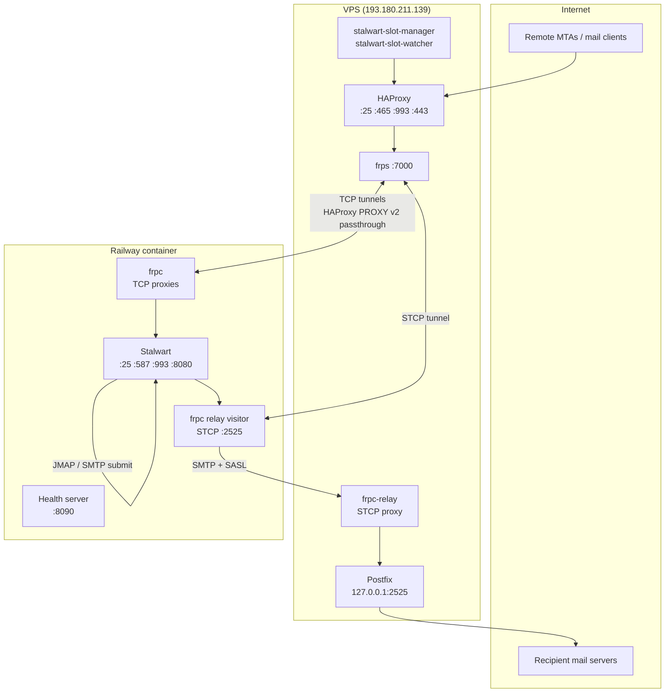
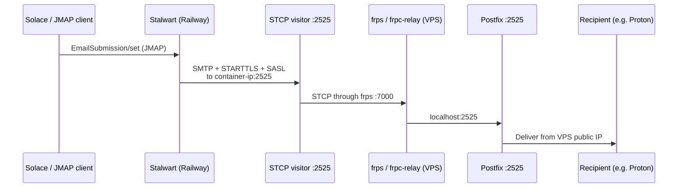
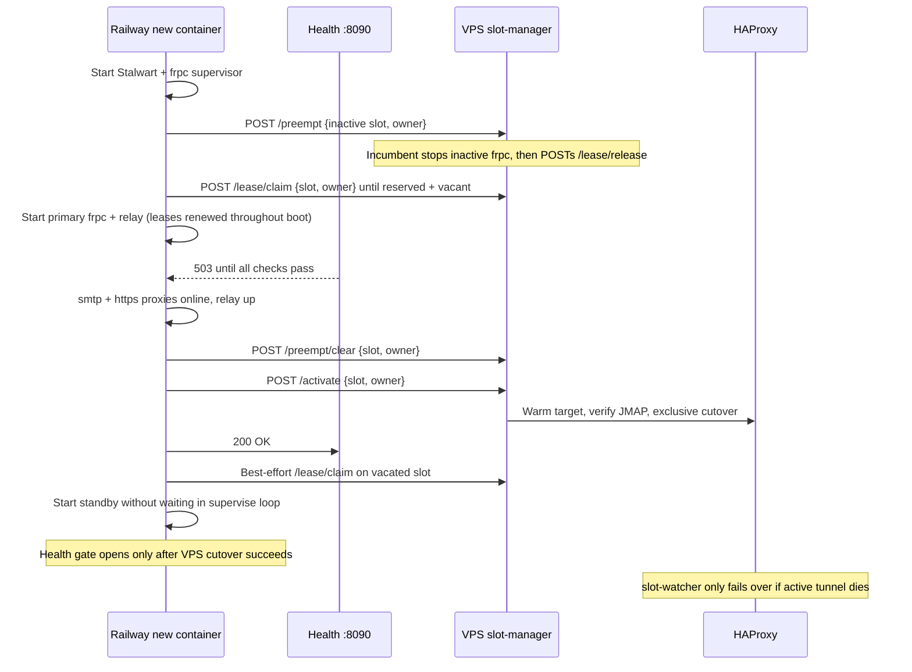

# Stalwart on Railway (Solace mail)

Stalwart mail server runs on [Railway](https://railway.app). A public VPS
(`mail.solace.onl` / `193.180.211.139`) owns the MX, TLS certificates, and
inbound ports. Railway containers connect **outbound** to the VPS over frp — no
inbound connections to Railway are required.

Desired state for Stalwart objects lives in [`stalwart/plan/`](stalwart/plan/).
WebUI edits are overwritten on the next Railway boot. This tree lives in the Solace
monorepo at `apps/stalwart` (not a nested git repo).

## System overview



## Config as code

[`config.json`](railway-entrypoint.sh) only names the **DataStore** (templated from Railway `PG*` env).
Everything else is JMAP objects, applied from NDJSON on every boot:

```sh
scripts/stalwart-plan.sh dry-run
scripts/stalwart-plan.sh apply
scripts/stalwart-plan.sh snapshot
scripts/stalwart-plan.sh drift
scripts/stalwart-plan.sh dns-publish
```

`railway-entrypoint.sh` runs `stalwart-cli apply` after JMAP is up and **before** the relay IP patch.
Failing apply fails the boot.

**In git:** Domain `solace.onl`, DNS/ACME/DKIM *policy*, NetworkListeners, HTTP security, Cache/JMAP/SystemSettings, MTA-STS, SenderAuth, ReportSettings, BlobStore (S3 via `EnvironmentVariable`), MetricsStore/TracingStore, Alerts, WebHooks.

**Not in git:** user accounts, mailbox data, Certificates, DkimSignature private keys, `MtaRoute.address` (container IP), Tasks/queues/logs.

**Secrets** stay in Railway variables. Plan objects use `{"@type":"EnvironmentVariable","variableName":"..."}`. Snapshot strips secrets; omit a secret field on apply so live credentials are not wiped.

DKIM keys rotate automatically (`dkimManagement: Automatic`). Stalwart does **not** continuously reconcile Cloudflare; after a new selector, run `scripts/stalwart-plan.sh dns-publish`. Do not flip MTA-STS to `enforce` until TLS-RPT reports arrive.

Admin UI is allowlisted on public HTTPS via VPS file `/etc/haproxy/admin-allow.lst` (from GitHub Environment secret `ADMIN_ALLOW_IP` on `mail-vps`; never committed). Tunnel fallback: `ssh -N -L 8080:127.0.0.1:8080 USER@mail.solace.onl` then `http://127.0.0.1:8080/admin/`.

## Inbound mail (Internet → Stalwart)

```mermaid
sequenceDiagram
    participant C as Mail client / MTA
    participant H as HAProxy (VPS)
    participant F as frps → frpc tunnel
    participant S as Stalwart (Railway)

    C->>H: SMTP :25 / IMAPS :993 / HTTPS :443
    Note over H: TLS termination on :443<br/>one PROXY v2 header from HAProxy; frpc must not add another
    H->>F: Forward to localhost frps port<br/>(blue or green slot)
    F->>S: frpc TCP proxy → Stalwart listener
    S-->>C: Mail delivery / JMAP / IMAP
```

HAProxy routes to **blue** or **green** frps ports based on
`/etc/haproxy/stalwart-active-slot`. Railway's `FRPC_SLOT=auto` picks the **inactive** side so a new deploy tunnels up before the VPS switches traffic. `frpc-supervisor.py` owns both slot processes and the relay visitor. After the health gate opens it attempts a **warm standby frpc** on the vacated slot (`FRPC_STANDBY_ENABLED`, default on), without blocking crash recovery. The next deploy preempts and claims the inactive slot through slot-manager protocol v2. The incumbent stops that slot's process and acknowledges release before the peer can claim it, including after watcher failover changes which slot is active. frpc logs are mirrored to Railway stderr (`[frpc-blue]` / `[frpc-green]`).

| Slot  | SMTP frps port | HTTPS frps port |
|-------|----------------|-----------------|
| blue  | 10025          | 18080           |
| green | 11025          | 19080           |

## Outbound mail (Solace / JMAP → Internet)

Railway **blocks outbound SMTP ports** (25, 587, 465). Outbound mail uses an
frp **STCP** tunnel. At boot the entrypoint starts the visitor on `:2525`, patches `MtaRoute.address` to the container private IP, then reloads settings.

See [vps/OUTBOUND_RELAY.md](vps/OUTBOUND_RELAY.md).



## Blue/green deploys



Railway probes `GET /healthz/ready` on `PORT` (8090). Healthcheck, overlap, and drain live in the repo-root [`.railway/railway.ts`](../../.railway/railway.ts).

Readiness requires Stalwart, relay, and **either** live slot process with currently
running proxies from its loopback frpc `/api/status` endpoint. The entrypoint owns
the boot gate; the supervisor alone atomically publishes current child PIDs and
readiness. Recovery never closes the gate solely because primary died, and late
proxy/relay recovery is reflected automatically. Snapshots older than 15 seconds
are unhealthy.

**Rollout order:** deploy the VPS slot-manager/switch scripts first, verify
`GET /slot-manager/status` reports `protocolVersion: 2`, then deploy the Railway
image, then Gatus. Missing credentials, old manager versions, failed preemption,
or unknown/occupied slots must not fall back to uncoordinated binding.

## Repository layout

| Path | Purpose |
|------|---------|
| `stalwart/plan/` | Desired-state NDJSON (`stalwart-cli apply` on boot) |
| `scripts/stalwart-plan.sh` | apply / dry-run / snapshot / drift / dns-publish |
| `scripts/diag/` | JMAP profile, tracer, log analyze |
| `scripts/sync-haproxy-cert.py` | Export Stalwart ACME cert → HAProxy PEM |
| `scripts/test-relay-route.sh` | Offline tests for relay-route helpers |
| `railway-entrypoint.sh` | Stalwart + health server + frpc + plan apply + relay IP |
| `frpc-supervisor.py` | Child processes, expiring slot leases, nonblocking standby/recovery, live health snapshot |
| `Dockerfile` | Mail image (Railway `rootDirectory: apps/stalwart`) |
| [`vps/README.md`](vps/README.md) | VPS services, cutover, cert sync |
| `../../.github/workflows/sync-haproxy-cert.yml` | Weekly / on-demand HAProxy cert sync |
| `../../.railway/railway.ts` | Solace Railway IaC |

## Railway environment variables

| Variable | Required | Purpose |
|----------|----------|---------|
| `FRPS_ADDR` | yes | VPS IP or hostname |
| `FRPC_TOKEN` | yes | frp auth token (must match `vps/frps.toml`) |
| `STALWART_ADMIN_TOKEN` | yes | Plan apply + relay route at startup |
| `SLOT_MANAGER_TOKEN` | yes | Protocol v2 slot leases, preemption, and promotion; missing token fails boot |
| `PORT` | yes | Set to `8090` — Railway healthcheck port |
| `PGHOST`, `PGPASSWORD`, etc. | yes | PostgreSQL (Railway plugin) |
| `BUCKET` / `BUCKET_*` | yes | Railway bucket refs for S3 BlobStore |
| `STALWART_MAIL_INGEST_WEBHOOK_SECRET` | no | HMAC for Solace `message-ingest.ham` webhook (omit from plan if unset; live HMAC is kept) |
| `FRPC_SLOT` | no | `blue`, `green`, or `auto` (default) |
| `FRPC_STANDBY_ENABLED` | no | Also tunnel the vacated slot after promote (default `true`) |
| `FRPC_PRIMARY_VACANT_TIMEOUT_SECONDS` | no | Elapsed-time deadline for preempt + primary claim (default `60` seconds); timeout fails boot |
| `FRPC_STANDBY_VACANT_TIMEOUT_SECONDS` | no | Nonblocking claim window (default `300` seconds); on expiry defer for 30 seconds and retry, never force bind |
| `FRPC_READY_TIMEOUT_SECONDS` | no | Primary boot / standby registration deadline (default `120` seconds); standby failure releases its lease and retries |
| `STALWART_HTTP_PORT` | no | Stalwart HTTP/JMAP port (default `8080`) |
| `RELAY_ROUTE_ID` | no | Stalwart MtaRoute id (default `ivnbzc1aaba9`) |
| `RELAY_BIND_ADDR` | no | Override container private IP for relay route |
| `PG_POOL_MAX_CONNECTIONS` | no | Stalwart → Postgres pool size (default `6`) |

Use the **private** Postgres hostname (`*.railway.internal`). Message bodies live in the Railway bucket (`BlobStore` S3); Postgres holds metadata.

## HA verification

```sh
python3 -B -m unittest discover -s apps/stalwart/tests -v
sh apps/stalwart/scripts/test-relay-route.sh
shellcheck apps/stalwart/railway-entrypoint.sh apps/stalwart/vps/stalwart-switch-slot.sh
```

Run these from the monorepo root. The default suite covers ownership, pending
launches, expiry, failed coordination, standby/relay retries, failover, and health
publication. For the optional loopback-only frp integration test, set
`FRPC_TEST_BINARY` and `FRPS_TEST_BINARY` to existing version-matched binaries.
It uses temporary ports/configs and dummy credentials; it does not access mail.

## Status page

Uptime monitoring: [`apps/gatus/`](../gatus/README.md). Discord downtime alerts are Gatus-only (`DISCORD_WEBHOOK_URL`). Stalwart Enterprise Alerts in `stalwart/plan/40-integrations.ndjson` email `admin@solace.onl` for live counters.

## VPS

Copy configs from `vps/` to the VPS, enable services, and open firewall ports
22, 25, 80, 465, 587, 993, 443, 7000. Full reference: [vps/README.md](vps/README.md).
