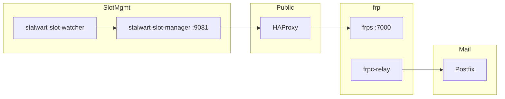

# VPS services

Public VPS at `193.180.211.139` (`mail.solace.onl`) for Stalwart on Railway.
Architecture diagrams: [README.md](../README.md).

## Service map



## Services

All systemd units should be enabled (`systemctl enable`) for boot.

### HAProxy

- **Role:** Public TCP/HTTP edge; TLS on :443; PROXY v2 to frps mail backends.
- **Ports:** 25, 80 (HTTPS redirect), 465, 993, 443.
  - **Public mail:** `/jmap`, `/.well-known`, `/api/discover`, `/api/auth`, `/auth/*` (OIDC token exchange for Solace).
  - **Allowlisted only:** `/admin`, `/login`, `/logo`, `/account`, `/oauth`, and other `/api/*`.
  - Non-allowlisted hits to `/` or admin surfaces return a small **HTML 404** (not an empty body — empty 404s made browsers download a `.bin`).
  - Allowlist file: `/etc/haproxy/admin-allow.lst` from GitHub Environment secret `ADMIN_ALLOW_IP` on `IIRoan/rocal` `mail-vps` (never in git).
  - Loopback Admin UI remains on `127.0.0.1:8080` via SSH tunnel.
- **Repo:** `vps/haproxy.cfg` → `/etc/haproxy/haproxy.cfg`
- **Active slot:** `/etc/haproxy/stalwart-active-slot` (`blue` or `green`)
- **TLS cert:** `/etc/haproxy/certs/mail.solace.onl.pem` (HAProxy terminates HTTPS). This file is **separate** from Stalwart’s ACME-managed certificates (used for SMTP STARTTLS on :25). Renewing Stalwart ACME does **not** update HAProxy.
  - One-shot: `vps/install-haproxy-cert.sh`
  - Automated: GitHub Action + [`scripts/sync-haproxy-cert.py`](../scripts/sync-haproxy-cert.py) (see [HAProxy TLS cert sync](#haproxy-tls-cert-sync))

### Automated VPS deploy (protected)

Merging allowlisted `apps/stalwart/vps/` files to **`master`/`main`** triggers [`.github/workflows/sync-mail-vps.yml`](../../../.github/workflows/sync-mail-vps.yml), which SSHs to the VPS and runs [`apply-vps-repo.sh`](apply-vps-repo.sh).

Security model: **merge-time gates + narrow deploy**, not a manual Actions click.

| Gate | Purpose |
|------|---------|
| Branch protection on `master` | No drive-by pushes; PR + Code Owner review required |
| CODEOWNERS (`@IIRoan`) | `.github/workflows/` + `apps/stalwart/vps/` need owner review |
| Environment `mail-vps` | Secrets only; deployment branches limited to `master`/`main` |
| No `pull_request` trigger | Fork PRs never receive `mail-vps` secrets |
| Explicit file allowlist | Only known basenames are copied (not a recursive `vps/` dump) |
| `apply-vps-repo.sh` default-deny | Skips frp/systemd unit installs unless opted in |
| Manual `workflow_dispatch` | Owner-only fallback (e.g. re-run without a new commit) |

#### Required GitHub settings

These must be on for the model to hold (script below applies them when you have admin rights):

1. **Branch protection** on `master` (and `main` if used):
   - Require a pull request before merging
   - Require review from Code Owners
   - Restrict who can push / dismiss reviews (you / admins)
   - Block force pushes and deletions
2. **Environment `mail-vps`**:
   - Deployment branches: **Selected** → `master`, `main`
   - Optional: required reviewers if you want a second click after merge (solo owners usually skip this so deploy stays automatic after a protected merge)
3. Never attach `mail-vps` secrets to workflows that run on `pull_request` from forks.

Local / emergency apply (bypasses GitHub; trusted shell only):

```bash
sudo APPLY_ALLOWLIST=/path/to/admin-allow.lst ./apply-vps-repo.sh .
```

Secrets: Environment **`mail-vps`** (see [HAProxy TLS cert sync](#haproxy-tls-cert-sync)). SSH user defaults to `Roan`. Long-term: least-privilege deploy user with sudo limited to `apply-vps-repo.sh` + `haproxy` reload.

### frps

- **Role:** Accepts inbound frp tunnels from Railway.
- **Port:** 7000 (control); dynamic proxy ports whitelisted in `vps/frps.toml`
- **Repo:** `vps/frps.toml` → `/etc/frp/frps.toml`

### frpc-relay

- **Role:** STCP proxy exposing Postfix `127.0.0.1:2525` to Railway relay visitors.
- **Repo:** `vps/frpc-relay.toml` → `/etc/frp/frpc-relay.toml`
- **Required** for outbound mail from Railway (see [OUTBOUND_RELAY.md](OUTBOUND_RELAY.md))

### Postfix

- **Role:** Authenticated submission relay; delivers to the internet from the VPS IP.
- **Listen:** `127.0.0.1:2525` (STCP from Railway), `0.0.0.0:587` (optional direct access)
- **SASL user:** `relay-client@mail.solace.onl`
- **Repo:** `vps/postfix-main.cf`, `vps/postfix-master.cf`

### stalwart-slot-manager

- **Role:** HTTP API for active slot; triggers HAProxy runtime reconfiguration. Also proxies `GET /metrics/prometheus` to the active slot's local HTTP port so Gatus scrapes never hit the warming slot during cutover.
- **Port:** 127.0.0.1:9081 (public via HAProxy `/slot-manager/`)
- **Repo:** `vps/stalwart-slot-manager.py` → `/usr/local/bin/stalwart-slot-manager.py`
- **Invokes:** `/usr/local/bin/stalwart-switch-slot` (no `.sh` suffix — see [Blue/green cutover](#bluegreen-cutover))

### stalwart-switch-slot

- **Role:** HAProxy blue/green cutover when Railway calls `POST /slot-manager/activate`.
- **Repo:** `vps/stalwart-switch-slot.sh` → **`/usr/local/bin/stalwart-switch-slot`** (not `stalwart-switch-slot.sh`)
- **Gotcha:** `stalwart-slot-manager.py` and `stalwart-slot-watcher.py` default to the path **without** `.sh`. Installing only to `stalwart-switch-slot.sh` leaves the old script in place and restores deploy-time 503s.

### stalwart-slot-watcher

- **Role:** Failover-only — promotes the other slot when the active tunnel dies.
- **Repo:** `vps/stalwart-slot-watcher.py` → `/usr/local/bin/stalwart-slot-watcher`

### gatus-monitor (optional)

- **Role:** JSON health snapshot for Gatus SSH probes from Railway (`status.solace.onl`).
- **Repo:** `vps/gatus-monitor.sh` → `/usr/local/bin/gatus-monitor.sh`
- **Setup:** See [apps/gatus/README.md](../../gatus/README.md)
- **JMAP diagnostics:** reports `jmap.tunnel.ms` (frp → Stalwart) and `jmap.edge.ms` (HAProxy → frp → Stalwart)

## Blue/green cutover

Railway picks the **inactive** slot (`FRPC_SLOT=auto`), starts frpc, then calls
`POST /slot-manager/activate` **before** opening the Railway health gate. The VPS
switch script:

1. Leaves the **incumbent** at 100% weight and warms the target at 1%.
2. Probes JMAP directly on the target frp port (`127.0.0.1:18080` or `:19080`).
3. Confirms the public edge (`https://mail.solace.onl/jmap/session`) still works
   while the incumbent carries traffic.
4. Flips to exclusive weights (target 100%, incumbent 0%) and puts the old slot
   in HAProxy maintenance.

This avoids `<NOSRV>` / 503 windows when the old Railway container retires mid-cutover.
Typical cutover time is ~5s.

`stalwart-slot-watcher` is **failover-only** — it does not participate in normal
deploys. See [README.md](../README.md) for the full sequence.

## Operations

Admin UI: from an allowlisted egress IP open `https://mail.solace.onl/admin/`. Otherwise tunnel:

```bash
ssh -N -L 8080:127.0.0.1:8080 USER@mail.solace.onl
# browse http://127.0.0.1:8080/admin/
```

Allowlist updates: set Environment secret `ADMIN_ALLOW_IP` on `mail-vps`, then run workflow **Sync HAProxy config**.

```bash
# Service status
systemctl status haproxy frps frpc-relay postfix stalwart-slot-manager stalwart-slot-watcher

# Active slot
cat /etc/haproxy/stalwart-active-slot

# Manual slot switch
sudo /usr/local/bin/stalwart-switch-slot blue
sudo /usr/local/bin/stalwart-switch-slot green

# Install / update VPS scripts from repo checkout
sudo install -m 755 vps/stalwart-switch-slot.sh /usr/local/bin/stalwart-switch-slot
sudo install -m 644 vps/stalwart-slot-manager.py /usr/local/bin/stalwart-slot-manager.py

# Config validation
sudo haproxy -c -f /etc/haproxy/haproxy.cfg && sudo systemctl reload haproxy
sudo /usr/local/bin/haproxy-sync-active-slot.sh
sudo postfix check && sudo systemctl reload postfix
```

## Firewall (UFW)

Allow: 22, 25, 80, 465, 587, 993, 443, 7000 (frp control from Railway).

Port 80 must be open so HAProxy can 301 to HTTPS and send HSTS. Do not leave it firewalled/black-holed.

Port 2525 is **not** exposed publicly — only reachable via the STCP tunnel.

## HAProxy TLS cert sync

HAProxy terminates `https://mail.solace.onl` with `/etc/haproxy/certs/mail.solace.onl.pem`.
Stalwart ACME renewal does **not** update that PEM. [`scripts/sync-haproxy-cert.py`](../scripts/sync-haproxy-cert.py)
copies the newest Stalwart cert+key onto the VPS.

Workflow: [`.github/workflows/sync-haproxy-cert.yml`](../.github/workflows/sync-haproxy-cert.yml)

| Trigger | Behavior |
|---------|----------|
| Cron (Mondays 06:17 UTC) | Sync only if live HTTPS cert expires within **14 days** |
| `workflow_dispatch` on `main` | Defaults to `--force` (sync now) |

GitHub Environment **`mail-vps`** (`master`/`main` only) holds:

| Secret | Purpose |
|--------|---------|
| `STALWART_DATABASE_URL` | Public Postgres URL (`DATABASE_PUBLIC_URL` from Railway `Postgres-stalwart`) |
| `VPS_SSH_PRIVATE_KEY` | Private key for `gh-cert-sync` on the mail VPS |
| `VPS_SSH_HOST` | default `mail.solace.onl` |
| `VPS_SSH_USER` | default `Roan` |
| `VPS_SSH_PORT` | default `22` |
| `ADMIN_ALLOW_IP` | Operator egress IP/CIDR for public `/admin` + admin OAuth surfaces (written to `/etc/haproxy/admin-allow.lst`; never in git) |

Public mailbox `/account` and `/login` are blocked except for the allowlisted IP (admin OAuth only). JMAP (`/jmap`) stays public for Solace clients.

HAProxy / VPS deploy is automated on protected `master` merges ([`.github/workflows/sync-mail-vps.yml`](../../../.github/workflows/sync-mail-vps.yml)); see [Automated VPS deploy](#automated-vps-deploy-protected). Legacy manual alias: [`.github/workflows/sync-haproxy-cfg.yml`](../../../.github/workflows/sync-haproxy-cfg.yml).

Bootstrap on the VPS as root:

```bash
sudo ./vps/setup-gh-cert-sync-user.sh
```

Paste the printed key into `VPS_SSH_PRIVATE_KEY`, set `VPS_SSH_USER=gh-cert-sync`, then delete `/root/gh-cert-sync-github-haproxy-cert.pem`.

Manual run:

```bash
export STALWART_DATABASE_URL='postgresql://…'
export VPS_SSH_PRIVATE_KEY="$(cat ~/.ssh/id_ed25519)"
export VPS_SSH_HOST=193.180.211.139
export VPS_SSH_USER=gh-cert-sync
pip install 'psycopg[binary]'
python3 scripts/sync-haproxy-cert.py --force
```
